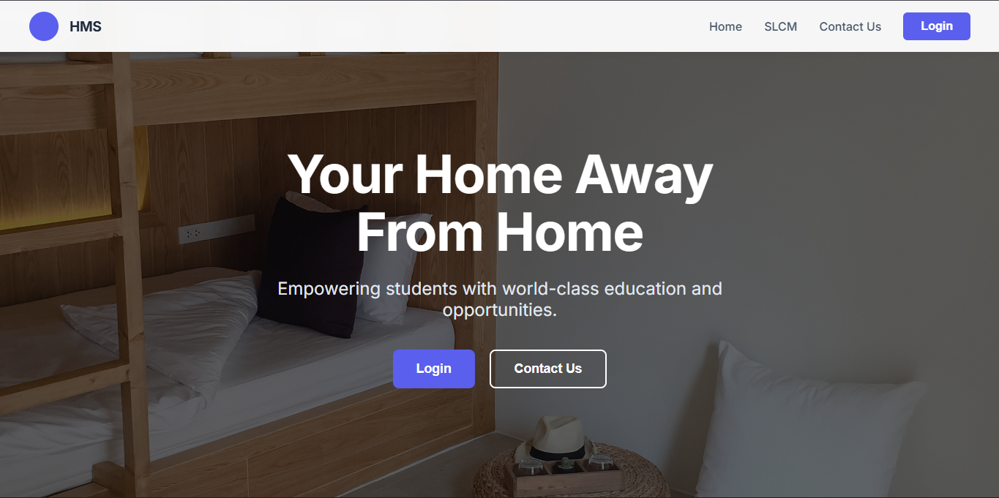
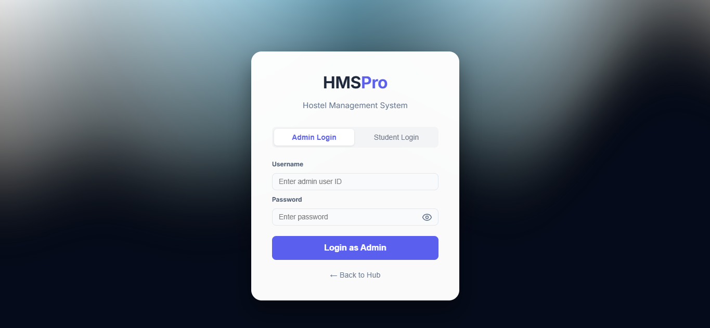
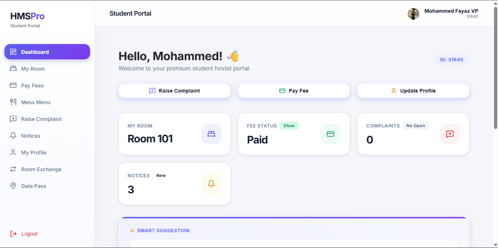
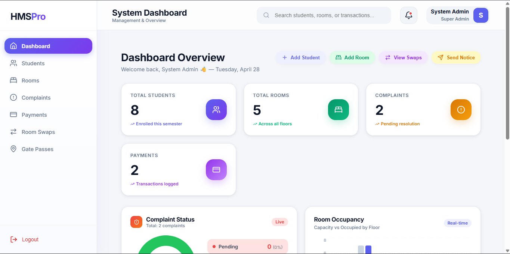
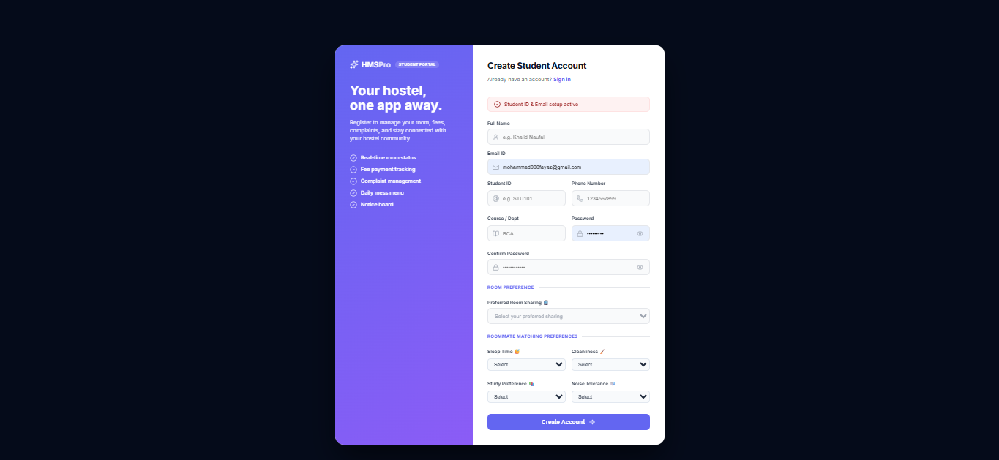

# 🏨 HMS Pro: AI-Powered Hostel Management System

<div align="center">
  
  
  
  
  
</div>

<br />

**HMS Pro** is a premium, full-stack hostel management solution that redefines student living through AI-driven roommate matching and secure room exchange hubs. Built with a focus on performance, aesthetics, and user experience, it streamlines operations for administrators while providing students with a high-end, interactive portal.

[**🌐 Live Demo**](https://hostel-management-system-frontend-eight.vercel.app/) • [**📄 Documentation**](docs/PRD.md) • [**🐛 Report Bug**](https://github.com/fayzii007/hostel-management-system/issues)

---

## 📸 Visual Showcase

### 🏠 Landing Page
*The gateway to a premium hostel experience.*


### 🔐 Multi-Role Authentication
*Secure access for both Students and System Administrators.*


### 🎓 Student Portal
*A personalized dashboard for room management, payments, and notices.*


### 👔 Admin Control Center
*Comprehensive overview of students, rooms, payments, and complaint resolutions.*


### 📝 Smart Registration
*Intelligent onboarding with roommate matching preference capture.*


---

## ✨ Key Innovation Features

### 🤖 Smart Roommate Matching
- **AI Compatibility Scoring**: Matches students based on a 4-point lifestyle algorithm (Sleep, Cleanliness, Study, Noise).
- **Real-time Recommendations**: Instant suggestions of the best potential roommates with percentage-based compatibility scores.

### 🔁 Mutual Room Exchange Hub
- **Peer-to-Peer Swapping**: Secure system for students to find swap candidates and exchange rooms instantly.
- **AI Auto-Suggest**: Smart recommendations for the best students to swap with to improve lifestyle harmony.
- **Mutual Consent Workflow**: Automated atomic swaps once both students accept the request.

### 🍱 Premium Student Experience
- **Dynamic Dashboard**: Real-time stats on Room status, Fee payments, and Complaints.
- **SaaS Aesthetic**: Modern UI with glassmorphism, smooth transitions, and high-quality data visualizations.
- **Integrated Payments**: Secure fee payments powered by Razorpay.

---

## 🛠️ Tech Stack

- **Frontend**: React 18, Vite, React Router, Lucide Icons, Vanilla CSS Design System.
- **Backend**: Node.js, Express.js.
- **Database**: Supabase (PostgreSQL) with Real-time triggers & Row Level Security.
- **Payment Gateway**: Razorpay Integration.
- **Auth**: Supabase Auth (Unified Student/Admin login).
- **Deployment**: Vercel (Frontend & Backend).

---

## 🚀 Getting Started

### Prerequisites
- Node.js v18+
- Supabase Project & Razorpay API Keys

### Quick Setup

1. **Clone & Install**:
   ```bash
   git clone https://github.com/fayzii007/hostel-management-system.git
   cd hostel-management-system
   npm run install-all # Custom script or manual install in both dirs
   ```

2. **Database Migration**:
   - Initialize core schema using `backend/database.sql`.
   - Apply AI/Match features using `backend/roommate_matching.sql`.
   - Apply Room Swap features using `backend/room_swap.sql`.

3. **Environment Configuration**:
   Create `.env` files in both `frontend` and `backend` with your credentials.

4. **Run Development**:
   ```bash
   # From root (if scripts are set up) or separately:
   cd backend && npm run dev
   cd frontend && npm run dev
   ```

---

## 🔑 Demo Access

### Student Login
- **Username**: `user123`
- **Password**: `impelsys@123`

---

## 📈 Roadmap
- [x] AI Roommate Matching
- [x] Mutual Room Exchange
- [x] Online Payments (Razorpay)
- [ ] Mobile App (PWA)
- [ ] Visitor QR-code Entrance System
- [ ] Automated Mess Menu Management

---

<div align="center">
  <p>Built with ❤️ by <b>Mohammed Fayaz VP</b></p>
  <a href="https://github.com/fayzii007">
    
  </a>
</div>